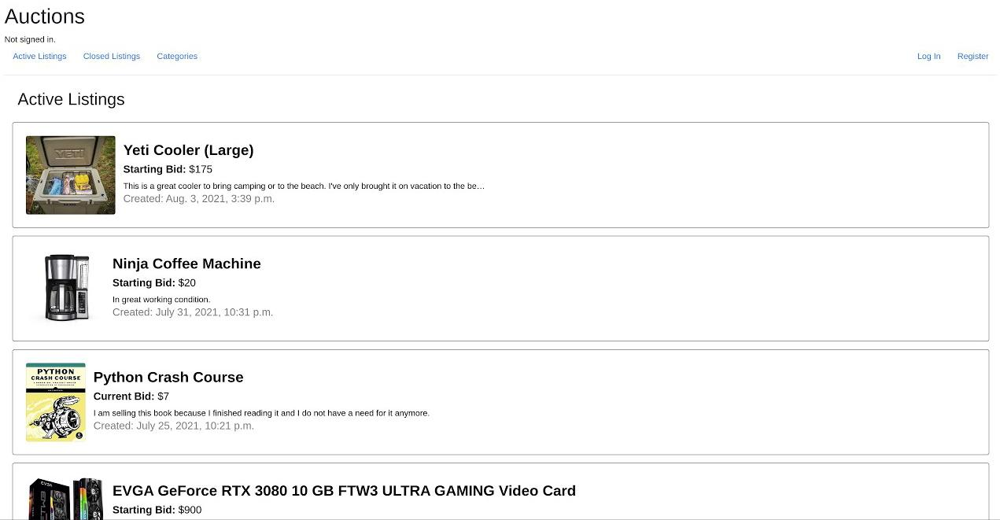

<h1 align="center">Commerce</h1>

    <a href="https://youtu.be/roAdth2IM9Y" target="_blank" rel="noopener noreferrer"><strong>Video Demo »</strong></a>

    An eBay-like e-commerce auction site that allows users to post auction listings, place bids on listings, comment on those listings, and add listings to a “watchlist.”

  
  
  
  

#### :warning: Disclaimer :warning:

> This project was completed as an <a href="https://cs50.harvard.edu/web/2020/projects/2/commerce/" target="_blank" rel="noopener noreferrer">assignment</a> for the course <a href="https://cs50.harvard.edu/web/2020/" target="_blank" rel="noopener noreferrer">CS50's Web Programming with Python and JavaScript.</a> Please note that this project does not represent my current coding abilities or best practices.

## How to Run

1. Create a <a href="https://packaging.python.org/en/latest/guides/installing-using-pip-and-virtual-environments/#creating-a-virtual-environment" target="_blank" rel="noopener noreferrer">virtual environment</a> and <a href="https://packaging.python.org/en/latest/guides/installing-using-pip-and-virtual-environments/#activating-a-virtual-environment" target="_blank" rel="noopener noreferrer">activate</a> it

2. Install the python requirements with pip inside of the newly created virtual environment

    `pip install -r requirements.txt`

3. Run migrations to generate the SQLite database and create the necessary tables

    `python manage.py migrate`

4. **Optional:** create an admin account to manage the backend

    `python manage.py createsuperuser`

5. Spin up the Django development server

    `python manage.py runserver`

By default, the server will be running at <a href="http://localhost:8000" target="_blank" rel="noopener noreferrer">http://localhost:8000</a>
